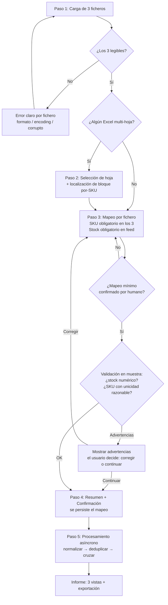
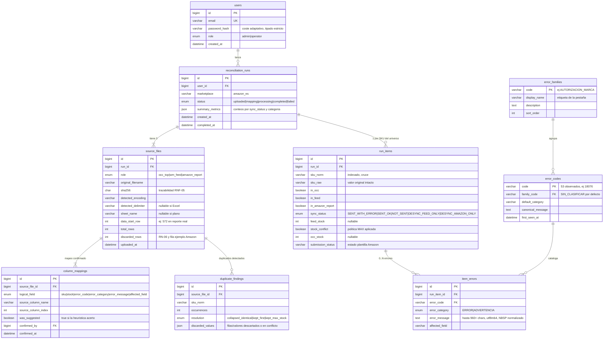

# 2. Especificación Funcional (Spec) — Módulo 1: Conciliador de Errores de Publicación Marketplace

> **Fase SDD:** `2/4 — Specification`
> **Estado:** `🟢 Aprobado (2026-06-12)`
> **Versión:** `1.1.0` — incorpora respuestas del cliente: agrupación de errores por familias (pestaña dedicada) y semántica de stock por cliente (origen PrestaShop, filtro stock > 0 no garantizado para otros clientes)
> **Última actualización:** 2026-06-12
> **Trazabilidad:** deriva de [`1_intent.md`](./1_intent.md) v1.2.0 (🟢 Aprobado)
> **Base empírica:** esta especificación se redactó tras el análisis forense de los 3 ficheros reales del cliente (sección 2.2). Toda regla de normalización, política de duplicados y caso borde cita evidencia observada, no supuestos.

---

## 2.1. Alcance (Scope)

### Dentro del alcance (In-Scope)

- Carga de los 3 ficheros (OCC top ventas, feed WaveMarket, reporte ListingLoader de Amazon) vía UI web.
- Asistente de Mapeo Dinámico: previsualización, sugerencia heurística y confirmación humana obligatoria de columnas (SKU en los 3 ficheros; stock en el feed; código/categoría/mensaje de error en el reporte de Amazon si el parser no los localiza de forma inequívoca).
- Normalización de SKUs, detección y resolución explícita de duplicados, cruce bidireccional de 3 vías.
- Clasificación de los códigos de error de Amazon en **familias de negocio** mediante taxonomía mantenible (sección 2.8).
- Informe en 3 vistas/pestañas (agregado por **familia de error** con drill-down por código / detalle por SKU con códigos y descripciones / salud de catálogo) con exportación a `.xlsx` y `.csv`.
- Persistencia de cada ejecución completa en MySQL (auditoría e histórico).
- Autenticación JWT (Access + Refresh) para todo el flujo.

### Fuera del alcance (Out-of-Scope)

- Escritura en Amazon Seller Central (SP-API) y corrección automática de errores.
- Edición manual de resultados persistidos desde la UI.
- Multi-tenancy facturable, gestión de organizaciones y alertas por email (módulos futuros).
- Ejecución de las macros contenidas en el `.xlsm` (el fichero se trata como datos, las macros se ignoran siempre).
- Soporte de marketplaces distintos de Amazon ES en el MVP (el modelo de datos sí lo prevé, ver 2.10).

---

## 2.2. Análisis de las Fuentes Reales (Data Profiling)

> Resultados del análisis de los ficheros reales adjuntados por el cliente. Estos hallazgos son **requisitos de ingesta**, no anécdotas.

### 2.2.1. `Libro1 (4).xlsx` — Top ventas OCC ausentes en Amazon ES

| Propiedad | Valor observado |
|---|---|
| Formato | XLSX, 1 hoja (`Hoja1`), 1 cabecera + 1.232 filas de datos |
| Cabeceras reales | `Name` \| `SKU` \| `Supplier` \| *(columna D sin cabecera)* \| `stock occ` |
| Columna SKU | Columna B (`SKU`) — pero **no debe asumirse**: requiere confirmación en el mapeo |
| **Suciedad detectada** | La columna D **no tiene cabecera** y contiene el literal `#N/A` en el **100% de las filas** (residuo de un `VLOOKUP` fallido). La ingesta debe tolerar columnas sin nombre y valores de error de Excel (`#N/A`, `#REF!`, `#VALUE!`) sin abortar. |
| Calidad de SKU | Sin duplicados, sin espacios en bordes, todo en mayúsculas. **2 SKUs comienzan por `0`**. Hay SKUs con `.`, `/` (ej.: `K2.65`, `MOMSERDAYTONABKL/OCC`) |
| Nota de estilo | Cabeceras mezclan idioma y capitalización (`Name` vs `stock occ`): el matching de cabeceras nunca puede ser exacto ni sensible a mayúsculas |

### 2.2.2. `amazon_ES_fullstock_20260219064620.csv` — Feed de WaveMarket

| Propiedad | Valor observado |
|---|---|
| Formato | CSV plano, **UTF-8 sin BOM**, delimitador `,`, EOL `\n`, 4.157 líneas (1 cabecera + 4.156 datos), ancho consistente (4 columnas en todas las filas) |
| Cabeceras reales | `sku,stock,site,condition` (minúsculas) |
| Stock | Entero en el 100% de filas; **no existe ninguna fila con stock = 0**. **Confirmado por el cliente:** el feed se exporta desde **PrestaShop** con un filtro `stock > 0` *para este cliente concreto*; otros clientes de la plataforma podrán enviar filas con stock 0 **o negativo**. La regla de priorización es por tanto `stock > 0` evaluada por fila, nunca "presente en el feed" |
| **Suciedad / riesgo detectado** | **4 SKUs con ceros a la izquierda** (`03763BAR`, `03763BBS`, `03763BNR`, `03763BRS`). Una lectura con inferencia de tipos los mutila. SKUs como `K2.65` serían coercionados a `float 2.65`. **Regla derivada: las columnas de SKU se leen SIEMPRE como texto (`dtype=str`), sin inferencia.** |
| Cardinalidad | `site` = `ES` y `condition` = `new` en el 100% de filas (constantes en este dataset; se persisten igualmente) |

### 2.2.3. `ListingLoadertestTodosProductos_20260224-processing-summary (6).xlsm` — Reporte de Amazon

| Propiedad | Valor observado |
|---|---|
| Formato | XLSM (con macros, ~992 KB), **8 hojas**: `Instrucciones`, `Resumen de procesamiento`, `Definiciones de datos`, `Dropdown Lists`, `AttributePTDMAP`, `Plantilla`, `Conditions List`, `Valores válidos` |
| Hojas relevantes | Solo 2: `Resumen de procesamiento` y `Plantilla`. El resto es metadata de Amazon y debe ignorarse |
| **Estructura no tabular** | `Resumen de procesamiento` contiene **3 bloques apilados verticalmente en la misma hoja**, con offset (los datos empiezan en columna B): (1) KPIs filas 3–8; (2) tabla agregada *"Errores y advertencias por código de error"* — cabecera en fila 11, datos filas 12–566, fila de total en 567; (3) tabla detalle *"Errores y advertencias por SKU"* — título en fila 570, cabecera en fila 571, **8.173 filas de datos desde la fila 572** |
| Cabecera del detalle por SKU | `#` \| `Código de error` \| `Categoría de error` \| `Mensaje de error` \| `Campo afectado (celda impactada)` \| `SKU` (el SKU está en la **última** columna, no en la primera) |
| Detalle por SKU | 8.173 filas de error → **4.000 SKUs únicos** (cardinalidad 1:N real: hasta **11 errores por SKU**, ej. `S01098S3MRN`). 53 códigos de error distintos. Categorías: `ERROR` (6.396) y `ADVERTENCIA` (1.777) |
| Hoja `Plantilla` | **Doble cabecera**: fila 4 (humana: `SKU`, `Submission Status`…) y fila 5 (técnica: `contribution_sku#1.value`, `::submission_status`…). La **fila 6 es una fila de EJEMPLO de Amazon** (`ABC123`, `UPC`, `714532191586`…) que **debe descartarse**. Datos reales desde la fila 7: 4.094 SKUs con `Submission Status` ∈ {`COMPLETADO CORRECTAMENTE`: 185, `ÉXITO (OTRO ERROR)`: 3.619, `ERROR`: 290} |
| **Suciedad detectada** | **463 mensajes de error contienen NBSP (`\xa0`, U+00A0)** (ej. `más de 1\u00a0GCID`); mensajes de hasta **960 caracteres**; fila 1 de `Plantilla` contiene blobs técnicos `settings=...` codificados en Base64 |

### 2.2.4. Cruces reales medidos (tras normalización `strip + upper`)

| Cruce | Resultado | Lectura de negocio |
|---|---|---|
| Libro1 ∩ feed | **524 de 1.232** | Solo el 42,5% del top ventas fue enviado a Amazon |
| Libro1 − feed | **708** | Top ventas nunca enviados (hallazgo de la vista de salud de catálogo) |
| feed − reporte Amazon | **62** (vs. `Plantilla`), **156** (vs. detalle de errores) | SKUs enviados sin resultado de procesamiento → **desincronización dirección feed→Amazon** |
| reporte Amazon − feed | **0** en este dataset | La dirección Amazon→feed (la del intent, RSK-05) no aparece en esta muestra, **pero el cruce sigue siendo bidireccional por diseño** |
| SKUs con error de los enviados | 4.000 de 4.094 (97,7%) | Confirma la urgencia del módulo |
| Duplicados (en cualquier fichero) | **0** tras normalización | La política de duplicados (2.6) es **preventiva pero obligatoria**: estos ficheros cambian en cada exportación |

---

## 2.3. Requisitos Funcionales (RF)

| ID | Requisito | Prioridad (MoSCoW) | Objetivo asociado | Criterio BDD |
|---|---|---|---|---|
| RF-01 | El sistema debe permitir cargar los 3 ficheros (roles: `occ_top`, `wm_feed`, `amazon_report`) en un solo flujo, aceptando `.xlsx`, `.xlsm`, `.csv`, `.txt`, con detección automática de encoding y delimitador en ficheros planos. | Must | OBJ-01 | CA-01 |
| RF-02 | Para ficheros Excel multi-hoja, el sistema debe permitir seleccionar la hoja de trabajo, sugiriendo la candidata por heurística (p. ej. `Plantilla` para el reporte de Amazon). | Must | OBJ-03 | CA-01 |
| RF-03 | El sistema debe mostrar una previsualización (cabeceras + ≥ 5 filas de muestra) y **exigir la confirmación humana** de la columna SKU en los 3 ficheros y de la columna stock en el feed, antes de habilitar el procesamiento. La heurística solo preselecciona, nunca decide. | Must | OBJ-03 | CA-01, CA-04 |
| RF-04 | El sistema debe normalizar los SKUs según las reglas RN-01..RN-06 (sección 2.5) antes de cualquier comparación, preservando siempre el valor crudo original. | Must | OBJ-02, OBJ-04 | CA-02, CA-03 |
| RF-05 | El sistema debe detectar SKUs duplicados por fichero tras normalización, reportarlos al usuario y aplicar la política de resolución de la sección 2.6 sin intervención silenciosa. | Must | OBJ-08 | CA-03 |
| RF-06 | El sistema debe ejecutar la conciliación de 3 vías y clasificar cada SKU con un `sync_status` (tabla 2.7), de forma asíncrona y con estado de progreso consultable. | Must | OBJ-02 | CA-02 |
| RF-07 | El sistema debe asociar a cada SKU enviado **todos** sus errores del reporte de Amazon (relación 1:N, hasta 11+ errores por SKU observados), con código, categoría, mensaje y campo afectado. | Must | OBJ-04 | CA-02 |
| RF-08 | El sistema debe presentar el informe en 3 vistas/pestañas: (1) **agregado por familia de error** (ej.: "Autorización de marca — 2.300 SKUs afectados") con drill-down a los códigos que la componen; (2) detalle por SKU con **todos sus códigos de error y la descripción de cada uno**; (3) salud de catálogo (desincronizados ordenados por stock desc, no enviados, duplicados). | Must | OBJ-04, OBJ-07 | CA-02, CA-05 |
| RF-09 | Las 3 vistas deben ser exportables a `.xlsx` (un libro con 3 pestañas, replicando el informe solicitado originalmente) y `.csv`. | Must | OBJ-06 | — |
| RF-10 | Cada ejecución debe persistirse íntegra en MySQL: ficheros (metadatos + hash), mapeo confirmado, duplicados, resultados y errores (modelo 2.10). | Must | OBJ-04 | — |
| RF-11 | El acceso a toda funcionalidad requiere autenticación JWT con renovación transparente vía Refresh Token. | Must | OBJ-05 | — |
| RF-12 | El sistema debe recordar el último mapeo confirmado por tipo de fichero (huella de cabeceras) y ofrecerlo como predeterminado en ejecuciones futuras. | Should | OBJ-03 | — |
| RF-13 | El usuario debe poder consultar el histórico de ejecuciones y reabrir el informe de cualquier ejecución pasada. | Should | OBJ-04 | — |
| RF-14 | El sistema debe clasificar cada código de error de Amazon en una **familia de negocio** según la taxonomía de la sección 2.8. Los códigos no contemplados se asignan a la familia `SIN_CLASIFICAR` y se reportan de forma visible (nunca se descartan ni se clasifican en silencio). La taxonomía es un catálogo de datos mantenible, no lógica cableada en código. | Must | OBJ-04 | CA-05 |

---

## 2.4. Requisitos No Funcionales (RNF)

| ID | Categoría | Requisito | Métrica verificable |
|---|---|---|---|
| RNF-01 | Rendimiento (UI) | Carga → previsualización para mapeo. | < 3 s para ficheros ≤ 50 MB (OBJ-01) |
| RNF-02 | Rendimiento (proceso) | Conciliación completa asíncrona, ficheros de hasta 100k filas. | p95 < 30 s (OBJ-02) |
| RNF-03 | Integridad | Las columnas de SKU se leen como texto, sin inferencia de tipos, en todos los parsers. | Test de regresión con `03763BAR` y `K2.65`: el valor persiste byte a byte en `sku_raw` |
| RNF-04 | Seguridad | JWT Access (corta duración) + Refresh (rotativo); hashing de contraseñas con algoritmo de coste adaptativo y tipado estricto en toda la lógica de cifrado (sin conversiones de formato inseguras). | Auditoría OWASP API Top 10 sin hallazgos críticos |
| RNF-05 | Trazabilidad | Toda ejecución es reproducible: hash SHA-256 de cada fichero + mapeo confirmado persistidos. | 100% de ejecuciones con `sha256` y mapeo no nulos |
| RNF-06 | Portabilidad | Todos los servicios contenedorizados (OCI/Docker); sin dependencias de filesystem local para resultados. | `docker compose up` levanta el sistema completo |
| RNF-07 | Observabilidad | Logs estructurados con id de ejecución correlacionable extremo a extremo. | Toda traza de procesamiento filtrable por `run_id` |
| RNF-08 | UX | El procesamiento es inalcanzable desde la UI mientras el mapeo no esté confirmado (gate bloqueante). | Test E2E: botón "Procesar" deshabilitado sin mapeo completo |

---

## 2.5. Reglas de Normalización de SKU

> Derivadas de la evidencia de 2.2. Se aplican **solo a la clave de cruce** (`sku_norm`); el valor original se conserva siempre (`sku_raw`).

| ID | Regla | Evidencia que la justifica |
|---|---|---|
| RN-01 | **Lectura como texto:** toda columna mapeada como SKU se lee con tipo string forzado, sin inferencia numérica ni de fechas. | `K2.65` → un parser numérico lo convierte en `2.65`; `03763BAR` y los 2 SKUs de Libro1 con cero inicial perderían el `0` si la celda fuera numérica |
| RN-02 | **Preservar ceros a la izquierda:** nunca se eliminan. | 4 SKUs del feed y 2 de Libro1 empiezan por `0`; quitarlos rompería el cruce |
| RN-03 | **Normalización de espacios:** reemplazar NBSP (U+00A0) y demás espacios Unicode por espacio simple, colapsar espacios internos consecutivos y aplicar `trim` en los bordes. | 463 mensajes del reporte contienen NBSP; aunque hoy los SKUs llegan limpios, los ficheros cambian por exportación y este es el fallo silencioso clásico de VLOOKUP |
| RN-04 | **Mayúsculas:** comparación en `UPPER` (los 3 ficheros llegan hoy en mayúsculas, pero no es garantizable). | Cabeceras ya demuestran inconsistencia de capitalización entre ficheros (`SKU` vs `sku`) |
| RN-05 | **Caracteres conservados:** `. - / _` y alfanuméricos son parte legítima del SKU y **no** se eliminan ni traducen. | `K2.65`, `MOMSERDAYTONABKL/OCC`, `S002343NRRS2M` |
| RN-06 | **Valores inválidos:** tras RN-01..05, un SKU vacío o igual a un literal de error de Excel (`#N/A`, `#REF!`, `#VALUE!`, `#DIV/0!`) se excluye del cruce y se contabiliza en `filas_descartadas` del informe (nunca se descarta en silencio). | Columna D de Libro1 contiene `#N/A` en el 100% de filas; si el usuario mapeara una columna equivocada, el sistema debe degradar con diagnóstico claro |

**Definición formal:** `sku_norm = UPPER(COLLAPSE_WS(REPLACE_UNICODE_WS(TRIM(raw))))`, con `raw` leído como string. La función es pura, determinista y se especificará con tests unitarios de tabla en `4_tasks.md`.

---

## 2.6. Política de Resolución de Duplicados

> Hoy los 3 ficheros llegan sin duplicados (2.2.4), pero la política es obligatoria y preventiva (RSK-06). Principio rector del intent: **nunca resolución silenciosa** — todo duplicado se reporta con recuento y filas de origen en la Vista 3 y se persiste en `duplicates`.

| Fichero | Caso | Política | Justificación |
|---|---|---|---|
| Cualquiera | Filas **idénticas** byte a byte (tras normalizar SKU) | Colapsar a 1 fila; registrar `resolution = collapsed_identical` con nº de ocurrencias | No hay ambigüedad: es ruido de exportación |
| `occ_top` (Libro1) | Mismo `sku_norm` con datos distintos (nombre/proveedor/stock occ) | Conservar la **primera ocurrencia**; registrar `resolution = kept_first` con las filas descartadas | Libro1 es una lista de referencia, no una fuente de cantidades a agregar |
| `wm_feed` | Mismo `sku_norm` con **stock distinto** | **No se suma.** Se toma `MAX(stock)`, se marca el ítem con `stock_conflict = true` y se registran todos los valores en conflicto | Sumar duplicará inventario si las filas son reenvíos del mismo stock (semántica no verificable). `MAX` es conservador para el objetivo de negocio: ante la duda, el SKU se prioriza para gestión humana en vez de ocultarse |
| `amazon_report` (detalle de errores) | Mismo `sku_norm` en varias filas | **No es duplicado: es cardinalidad legítima 1:N** (un SKU acumula hasta 11+ errores). Solo se deduplican filas de error idénticas (mismo `sku_norm + código + mensaje + campo afectado`) | Evidencia 2.2.3: 8.173 filas de error para 4.000 SKUs |

---

## 2.7. Clasificación de Conciliación (`sync_status`)

Cruce de 3 vías sobre `sku_norm`. Cada SKU del universo (unión de las 3 fuentes) recibe exactamente un estado:

| `sync_status` | Condición (∈ occ / ∈ feed / ∈ amazon) | Lectura de negocio | Prioridad |
|---|---|---|---|
| `SENT_WITH_ERROR` | – / ✔ / ✔ y tiene ≥ 1 error | Enviado y rechazado o degradado: núcleo del informe | 🔴 Crítica si `stock > 0` |
| `SENT_OK` | – / ✔ / ✔ sin errores | Publicado correctamente | 🟢 Informativa |
| `NOT_SENT` | ✔ / ✘ / ✘ | Top ventas nunca enviado (708 casos reales) | 🟠 Alta si stock occ > 0 |
| `DESYNC_FEED_ONLY` | – / ✔ / ✘ | En el feed pero sin resultado de Amazon (62 casos reales): desincronización feed→Amazon | 🟠 Alta si `stock > 0` |
| `DESYNC_AMAZON_ONLY` | – / ✘ / ✔ | En Amazon pero ausente del feed WM (dirección del RSK-05; 0 casos en esta muestra, cubierta por diseño) | 🟠 Alta |

> El orden de presentación por defecto en la Vista 3 es: estado de mayor prioridad primero y, dentro de cada estado, `stock` descendente (los SKUs con stock disponible representan pérdida de venta activa).

---

## 2.8. Taxonomía de Familias de Error

> Respuesta directa al requisito del cliente: *"los errores deben agruparse por familias; si hay un error de marca que afecta a 2.300 productos, esta agrupación debe mostrarse en una pestaña específica"*. La Vista/Pestaña 1 agrega por familia; cada familia permite drill-down a sus códigos y de ahí a los SKUs afectados.

### Principios de la taxonomía

1. **Catálogo de datos, no código:** la relación código → familia vive en la tabla `error_families` / `error_codes` (sección 2.10) y es mantenible sin redespliegue.
2. **Cobertura total con fallback explícito:** todo código sin familia asignada cae en `SIN_CLASIFICAR`, visible en la Vista 1 con un aviso. Un código nuevo de Amazon nunca rompe el informe ni desaparece de él (RF-14).
3. **Clasificación por código, no por texto del mensaje:** los mensajes varían (incluyen valores interpolados como `TecDoc`, `motorcycle`); el código es el identificador estable.

### Familias iniciales (seed derivado de los 53 códigos reales observados)

| Familia | Descripción de negocio | Códigos observados (muestra) | Volumen real observado |
|---|---|---|---|
| `AUTORIZACION_MARCA` | El vendedor necesita aprobación para publicar la marca o hace uso indebido de marcas | 18299, 18749, 18570, 18146 | ≈ 1.983 errores (la "familia de marca" que cita el cliente) |
| `RESTRICCION_PUBLICACION` | El producto está sujeto a restricciones de categoría/publicación de Amazon | 18076, 18369, 100332 | ≈ 2.629 errores |
| `CUMPLIMIENTO_NORMATIVO` | RGPP/GPSR: información de fabricante, persona responsable, advertencias de seguridad, etiquetado energético | 100526, 100527, 100528, 18616, 100229, 18917 | ≈ 1.450 advertencias/errores |
| `IDENTIFICADORES_PRODUCTO` | EAN/GTIN/UPC inválidos, cortos o no aceptados | 90226 | ≈ 573 errores |
| `CALIDAD_DE_DATOS` | Atributos faltantes o inválidos, detalles insuficientes, valores no aceptados en listas (TecDoc, tallas…) | 8560, 100632, 18448, 99016, 99022, 90220, 90244, 90004205 | ≈ 600 errores |
| `IMAGENES` | Imagen principal ausente o no conforme (texto, logos, marcas de agua) | 18320, 18027 | ≈ 68 errores |
| `SIN_CLASIFICAR` | Fallback obligatorio para códigos nuevos o no mapeados | — | 0 con el seed completo |

> El mapeo completo de los 53 códigos al catálogo seed se materializa como dato inicial en `4_tasks.md`. La validación final de nombres y agrupaciones de familia corresponde al cliente (pregunta abierta #2: ✅ resuelta en lo estructural; el naming fino puede ajustarse en UAT sin impacto de diseño).

---

## 2.9. Asistente de Mapeo Dinámico — Flujo UX

### Principios

1. **Bloqueante:** el botón *Procesar* permanece deshabilitado hasta que el mapeo mínimo esté confirmado (RNF-08).
2. **Sugerir, no decidir:** la heurística (nombres candidatos `sku`, `SKU`, `contribution_sku#1.value`; perfil de valores: unicidad alta, patrón alfanumérico) preselecciona candidatas marcadas visualmente como "sugerencia"; el usuario confirma o corrige.
3. **Transparencia del parser:** lo que la previsualización muestra es exactamente lo que el motor procesará (misma capa de ingesta).

### Pasos

| Paso | Pantalla | Comportamiento | Validación de salida |
|---|---|---|---|
| 1 | **Carga** | Tres zonas de arrastre etiquetadas por rol (`Top ventas OCC`, `Feed WaveMarket`, `Reporte Amazon`). Detección de formato, encoding y delimitador al soltar. | 3 ficheros legibles; si uno falla, error en lenguaje claro (no traza técnica) |
| 2 | **Selección de hoja** (solo Excel multi-hoja) | Lista de hojas con nº de filas; preselección heurística (`Plantilla` y `Resumen de procesamiento` para el reporte). Para el reporte de Amazon, el parser localiza el bloque *"Errores y advertencias por SKU"* por su fila de título y muestra desde dónde leerá (fila 572 en la muestra real). | Hoja con ≥ 1 fila de datos detectada |
| 3 | **Mapeo de columnas** (una sub-pantalla por fichero) | Tabla de previsualización (cabeceras + 5 filas). Selectores: `occ_top` → SKU (oblig.), stock OCC (opc.); `wm_feed` → SKU (oblig.), stock (oblig.); `amazon_report` → SKU, código, categoría, mensaje, campo afectado (preconfirmados si la cabecera estándar de Amazon se detecta; editables siempre). Si existe un mapeo previo con la misma huella de cabeceras (RF-12), se ofrece como predeterminado. | Columnas obligatorias confirmadas; el sistema valida en muestra que la columna stock es numérica y la SKU tiene unicidad razonable; discrepancias ⇒ advertencia explícita antes de continuar |
| 4 | **Resumen y confirmación** | Vista única: 3 ficheros, hojas elegidas, mapeo completo, filas a procesar y avisos (duplicados detectados en muestra, columnas con `#N/A`, fila de ejemplo de Amazon descartada). Botón *Confirmar y procesar*. | Confirmación explícita ⇒ se persiste el mapeo y arranca el procesamiento asíncrono |
| 5 | **Progreso** | Estados visibles: `Validando → Normalizando → Deduplicando → Cruzando → Persistiendo → Listo`, con conteos parciales. | Al completar, redirección automática al informe |

### Diagrama de flujo del asistente



---

## 2.10. Modelo de Datos Relacional (MySQL)

> Modelo lógico-relacional del dominio. Los detalles físicos finos (engine, charset `utf8mb4` obligatorio por los mensajes con NBSP y tildes, índices compuestos, particionado) se cierran en `3_plan.md`.

### Decisiones de modelado

- **`run` como agregado raíz:** todo cuelga de una ejecución (auditoría, RF-10/RNF-05).
- **`sku_raw` y `sku_norm` siempre juntos:** la clave de cruce nunca sustituye al valor original (RN-01..06).
- **Errores en tabla hija 1:N:** evidencia real de hasta 11 errores por SKU; `error_message` es `TEXT` (mensajes de hasta 960 caracteres observados).
- **`marketplace` en `runs`:** constante `amazon_es` en el MVP, previsto para multi-marketplace sin migración destructiva.
- **Catálogo de códigos de error (`error_codes`) y familias (`error_families`):** los 53 códigos observados se normalizan a catálogo y cada uno pertenece a una familia de negocio (sección 2.8), de modo que la Vista 1 agrega por familia de forma estable entre ejecuciones y los códigos nuevos caen en `SIN_CLASIFICAR` sin romper el informe.



> Nota de unicidad: `UNIQUE(run_id, sku_norm)` en `run_items` y `UNIQUE(source_file_id, logical_field)` en `column_mappings`. La tabla de Refresh Tokens (rotación/revocación JWT) es infraestructura transversal de la plataforma y se especifica en `3_plan.md`.

---

## 2.11. Criterios de Aceptación (BDD — Gherkin)

### CA-01 — Mapeo dinámico de SKU y Stock — caso feliz `(cubre RF-01, RF-02, RF-03)`

```gherkin
Característica: Asistente de Mapeo Dinámico
  Como gestor de operaciones
  Quiero confirmar qué columna contiene el SKU y el stock en cada fichero
  Para garantizar que la conciliación cruza los datos correctos

  Antecedentes:
    Dado que estoy autenticado como "operator"
    Y he cargado "Libro1.xlsx" como "Top ventas OCC"
    Y he cargado "amazon_ES_fullstock.csv" como "Feed WaveMarket"
    Y he cargado "ListingLoader-processing-summary.xlsm" como "Reporte Amazon"

  Escenario: Confirmación del mapeo sugerido de SKU y stock
    Dado que el sistema detectó el CSV como "UTF-8" con delimitador ","
    Y el sistema localizó el bloque "Errores y advertencias por SKU" del reporte
    Cuando abro el paso de mapeo del fichero "Feed WaveMarket"
    Entonces veo una previsualización con las cabeceras "sku, stock, site, condition" y 5 filas de muestra
    Y la columna "sku" aparece preseleccionada como SKU con la marca "sugerencia"
    Y la columna "stock" aparece preseleccionada como Stock con la marca "sugerencia"
    Cuando confirmo el mapeo de los 3 ficheros
    Entonces el botón "Procesar" pasa a estar habilitado
    Y el mapeo confirmado queda persistido con mi usuario y marca de tiempo

  Escenario: El procesamiento es inalcanzable sin confirmación humana
    Dado que la heurística sugirió columnas SKU en los 3 ficheros
    Pero no he confirmado el mapeo del fichero "Reporte Amazon"
    Cuando intento iniciar el procesamiento
    Entonces el sistema lo rechaza indicando "mapeo pendiente de confirmación"
    Y ningún dato de la ejecución se persiste como procesado

  Escenario: Los SKUs sobreviven intactos a la ingesta
    Dado que el feed contiene los SKUs "03763BAR" y "K2.65"
    Cuando confirmo el mapeo y finaliza el procesamiento
    Entonces el campo sku_raw almacenado para ambos es exactamente "03763BAR" y "K2.65"
    Y ningún SKU fue convertido a número ni perdió ceros a la izquierda
```

### CA-02 — Conciliación y SKUs desincronizados `(cubre RF-04, RF-06, RF-07, RF-08)`

```gherkin
Característica: Conciliación de 3 vías con detección de desincronización
  Como gestor de operaciones
  Quiero ver qué SKUs están desincronizados entre WaveMarket y Amazon, priorizados por stock
  Para gestionar primero la pérdida de venta activa

  Antecedentes:
    Dado que existe una ejecución con mapeo confirmado de los 3 ficheros

  Escenario: SKU enviado con errores múltiples
    Dado que el SKU "S01098S3MRN" está en el feed con stock 4
    Y el reporte de Amazon contiene 11 filas de error para "S01098S3MRN"
    Cuando finaliza la conciliación
    Entonces "S01098S3MRN" tiene sync_status "SENT_WITH_ERROR"
    Y tiene exactamente 11 errores asociados con código, categoría, mensaje y campo afectado
    Y aparece en la Vista 2 con una fila por error

  Esquema del escenario: Clasificación bidireccional de sincronización
    Dado que el SKU "<sku>" está <en_occ> en OCC, <en_feed> en el feed y <en_amazon> en el reporte
    Cuando finaliza la conciliación
    Entonces el SKU "<sku>" recibe sync_status "<estado>"

    Ejemplos:
      | sku      | en_occ   | en_feed  | en_amazon | estado             |
      | AAA111   | ausente  | presente | ausente   | DESYNC_FEED_ONLY   |
      | BBB222   | ausente  | ausente  | presente  | DESYNC_AMAZON_ONLY |
      | CCC333   | presente | ausente  | ausente   | NOT_SENT           |
      | DDD444   | ausente  | presente | presente  | SENT_OK            |

  Escenario: Priorización por stock disponible en la vista de salud de catálogo
    Dado que los SKUs "AAA111" con stock 25 y "AAA222" con stock 1 son "DESYNC_FEED_ONLY"
    Cuando abro la Vista 3 "Salud de catálogo"
    Entonces "AAA111" aparece antes que "AAA222"
    Y ambos muestran un distintivo de "stock disponible"

  Escenario: Cruce insensible a suciedad de formato
    Dado que el feed contiene el SKU "TWA85XL"
    Y el reporte de Amazon contiene el SKU " twa85xl " con espacio NBSP final
    Cuando finaliza la conciliación
    Entonces ambos registros se cruzan como el mismo SKU "TWA85XL"
    Y no se genera ningún falso desincronizado
```

### CA-03 — Manejo de duplicados `(cubre RF-05)`

```gherkin
Característica: Detección y resolución explícita de duplicados
  Como gestor de operaciones
  Quiero que los duplicados se detecten, se resuelvan con una política conocida y se reporten
  Para que el informe nunca infle métricas en silencio

  Escenario: Filas idénticas en el feed se colapsan y se reportan
    Dado que el feed contiene 3 filas idénticas para el SKU "K570" con stock 1
    Cuando finaliza el procesamiento
    Entonces "K570" aparece una sola vez en los resultados con stock 1
    Y la Vista 3 registra el hallazgo "K570: 3 ocurrencias, resolución collapsed_identical"

  Escenario: Stock en conflicto en el feed — nunca se suma
    Dado que el feed contiene el SKU "TWA85XL" con stock 5 en una fila y stock 2 en otra
    Cuando finaliza el procesamiento
    Entonces "TWA85XL" queda con stock 5 y stock_conflict verdadero
    Y la Vista 3 muestra los valores en conflicto "5" y "2"
    Y en ningún caso el stock resultante es 7

  Escenario: Duplicado en Libro1 conserva la primera ocurrencia
    Dado que "Libro1" contiene el SKU "OCC20326" en la fila 3 con proveedor "OCC QUIMICOS"
    Y el mismo SKU en la fila 900 con proveedor "OTRO PROVEEDOR"
    Cuando finaliza el procesamiento
    Entonces los datos asociados a "OCC20326" son los de la fila 3
    Y la Vista 3 registra "OCC20326: 2 ocurrencias, resolución kept_first" con la fila descartada

  Escenario: Múltiples errores por SKU no se tratan como duplicados
    Dado que el reporte de Amazon contiene 8 filas de error distintas para "S00126941BMBI"
    Cuando finaliza el procesamiento
    Entonces "S00126941BMBI" conserva sus 8 errores asociados
    Y no figura en el reporte de duplicados
```

### CA-04 — Degradación explícita del mapeo de stock `(cubre RF-03, SUP-03)`

```gherkin
Característica: Validación del mapeo en muestra
  Escenario: La columna confirmada como stock no es numérica
    Dado que en el paso de mapeo del feed confirmo la columna "condition" como Stock
    Cuando el sistema valida la muestra
    Entonces recibo la advertencia "la columna seleccionada no contiene valores numéricos"
    Y puedo corregir el mapeo o continuar sin priorización por stock
    Y si continúo, el informe declara "priorización por stock no disponible" en la Vista 3

  Escenario: Feed de otro cliente con stock cero o negativo
    Dado que el feed contiene el SKU "XYZ100" con stock 0 y el SKU "XYZ200" con stock -3
    Cuando finaliza el procesamiento
    Entonces ambos SKUs se procesan sin error y conservan su valor de stock original
    Y ninguno de los dos recibe el distintivo de "stock disponible"
    Y la priorización por stock solo destaca SKUs con stock mayor que 0
```

### CA-05 — Agrupación de errores por familia `(cubre RF-08, RF-14)`

```gherkin
Característica: Informe agregado por familias de error
  Como gestor de operaciones
  Quiero ver los errores agrupados por familia de negocio en una pestaña dedicada
  Para dimensionar el impacto de cada problema (ej. autorización de marca) de un vistazo

  Escenario: La familia de marca agrega todos sus códigos
    Dado que la conciliación produjo 1786 errores con código "18299"
    Y 118 errores con código "18749"
    Y ambos códigos pertenecen a la familia "AUTORIZACION_MARCA"
    Cuando abro la Vista 1 "Errores por familia"
    Entonces veo la familia "Autorización de marca" con el total de SKUs únicos afectados
    Y al desplegarla veo el desglose por código: "18299" y "18749" con sus recuentos
    Y al seleccionar un código veo la lista de SKUs afectados con la descripción del error

  Escenario: Un código desconocido nunca desaparece del informe
    Dado que el reporte de Amazon contiene el código "99999" que no existe en el catálogo
    Cuando finaliza la conciliación
    Entonces el código "99999" se registra en el catálogo asignado a la familia "SIN_CLASIFICAR"
    Y la Vista 1 muestra la familia "Sin clasificar" con un aviso visible
    Y los SKUs afectados por "99999" conservan su detalle completo en la Vista 2

  Escenario: La exportación replica la estructura de pestañas
    Dado que la conciliación está completada
    Cuando exporto el informe a formato xlsx
    Entonces el libro contiene una pestaña con la agregación por familia y código
    Y otra pestaña con el detalle SKU, código de error y descripción
    Y otra pestaña con la salud de catálogo
```

---

## 2.12. Casos Borde y Manejo de Errores

> Todos derivados de evidencia real (2.2), no hipotéticos.

| ID | Escenario borde | Evidencia | Comportamiento esperado |
|---|---|---|---|
| EB-01 | Columna sin cabecera con `#N/A` en todas las filas (Libro1, col D) | 2.2.1 | La previsualización la muestra como `(sin nombre)`; si se mapeara como SKU, el 100% de filas caería en `discarded_rows` y el sistema bloquea con: "la columna elegida no contiene SKUs válidos" |
| EB-02 | Fila de ejemplo de Amazon (`ABC123`) en la fila 6 de `Plantilla` | 2.2.3 | El parser la descarta por posición/patrón documentado y la contabiliza en `discarded_rows`, visible en el resumen del paso 4 |
| EB-03 | Tres tablas apiladas en una sola hoja (`Resumen de procesamiento`) | 2.2.3 | El parser localiza el bloque por su fila de título "Errores y advertencias por SKU", nunca por posición fija; si el título no aparece, se solicita al usuario señalar la fila de cabecera |
| EB-04 | Doble cabecera (humana + técnica) en `Plantilla` | 2.2.3 | La previsualización muestra ambas; el mapeo se ancla a la fila de cabecera técnica (estable entre versiones de Amazon) con la humana como etiqueta visual |
| EB-05 | NBSP y mensajes de 960 caracteres | 2.2.3 | Mensajes normalizados (RN-03 aplica también a textos) y columna `TEXT` con `utf8mb4`; sin truncado silencioso |
| EB-06 | `.xlsm` con macros | 2.2.3 | Las macros nunca se ejecutan; solo se leen datos. El fichero se acepta sin advertencia de seguridad para el usuario final |
| EB-07 | Feed sin filas de stock 0 hoy, con ellas mañana | 2.2.2 + confirmación del cliente | **Confirmado:** este cliente exporta desde PrestaShop con filtro `stock > 0`, pero otros clientes enviarán stock 0 **o negativo**. La regla de "con stock" es `stock > 0` evaluada por fila; los valores 0 y negativos se aceptan, se persisten tal cual y nunca reciben el distintivo de stock disponible |
| EB-08 | Fichero correcto subido en el rol equivocado (feed como Libro1) | derivado | La heurística de huella de cabeceras advierte: "este fichero parece un feed WaveMarket"; el usuario decide |
| EB-09 | Encoding no UTF-8 en CSV futuro | derivado de 2.2.2 | Detección con fallback ordenado (UTF-8 → cp1252 → latin-1) y muestra visible en previsualización: si el usuario ve caracteres corruptos, puede forzar encoding |
| EB-10 | Código de error de Amazon no presente en el catálogo de familias | derivado de 2.8 | Alta automática en `error_codes` con familia `SIN_CLASIFICAR` y `first_seen_at`; aviso visible en la Vista 1. Un administrador puede reasignarlo a su familia correcta sin redespliegue (RF-14) |

---

## 2.13. Preguntas Abiertas

| # | Pregunta | Responsable | Impacto si no se resuelve | Resolución |
|---|---|---|---|---|
| 1 | ¿El feed de WaveMarket puede llegar a incluir filas con stock 0 o negativo? (hoy no ocurre) | Cliente / WaveMarket | — | ✅ **Resuelta (2026-06-12):** este cliente exporta desde PrestaShop con filtro `stock > 0`; otros clientes podrán enviar stock 0 o negativo. Incorporado en 2.2.2, EB-07 y CA-04 |
| 2 | ¿Los 53 códigos de error de Amazon deben agruparse además en familias de negocio (autorización de marca, GPSR, imágenes...) para la Vista 1? | Cliente | — | ✅ **Resuelta (2026-06-12):** sí, agrupación por familias en pestaña dedicada + pestaña de detalle SKU/código/descripción. Incorporado en 2.8, RF-08, RF-14, CA-05 y modelo de datos (`error_families`). El naming fino de las familias se valida en UAT |
| 3 | ¿Retención del histórico de ejecuciones (meses, indefinido)? | Cliente / DevOps | Se asume indefinido en MVP; afecta a dimensionamiento en `3_plan.md` | ⏳ Pendiente |

---

## ✅ Criterio de salida de fase (Gate)

- [x] Todo RF tiene criterio BDD o entregable verificable asociado (trazabilidad RF → CA en 2.3).
- [x] Reglas de normalización de SKU justificadas con evidencia de los ficheros reales (RN-01..06).
- [x] Política de duplicados explícita por fichero y por caso, sin resolución silenciosa, incluida la distinción duplicado vs. cardinalidad 1:N de errores.
- [x] Flujo UX del Asistente de Mapeo Dinámico definido paso a paso con gate bloqueante y diagrama.
- [x] Modelo de datos relacional MySQL definido con decisiones de modelado justificadas, incluida la taxonomía de familias de error.
- [x] Escenarios Gherkin cubren: caso feliz de mapeo SKU+stock (CA-01), desincronizados (CA-02), duplicados (CA-03), degradación/semántica de stock multi-cliente (CA-04) y agrupación por familias de error (CA-05).
- [x] Casos borde anclados a evidencia real del profiling, no a hipótesis.
- [x] Preguntas abiertas del cliente #1 y #2 resueltas e incorporadas (2026-06-12); #3 (retención) no bloqueante, se cierra en `3_plan.md`.
- [x] **Aprobación del solicitante de la v1.1.0** (2026-06-12).

> **Siguiente fase:** [`3_plan.md`](./3_plan.md) — Arquitectura de microservicios, ADRs, diagramas de despliegue (Docker/EC2/K8s-ready), pipeline CI/CD, diseño físico de MySQL y estrategia de procesamiento asíncrono.
