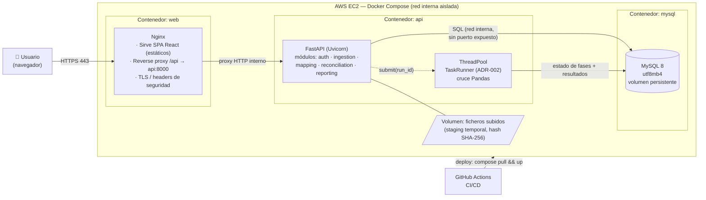
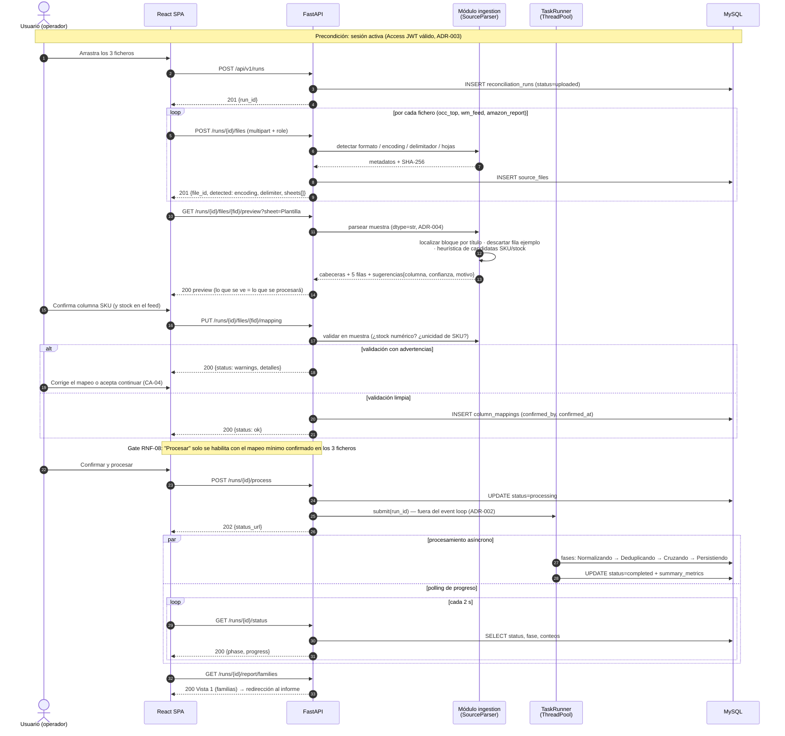
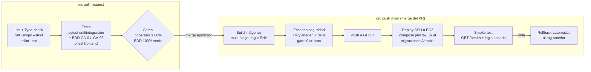

# 3. Plan Técnico y Diseño de Arquitectura (Plan) — Módulo 1: Conciliador de Errores de Publicación Marketplace

> **Fase SDD:** `3/4 — Technical Plan`
> **Estado:** `🟡 En revisión — pendiente de aprobación`
> **Versión:** `1.0.0`
> **Última actualización:** 2026-06-12
> **Trazabilidad:** implementa [`2_spec.md`](./2_spec.md) v1.1.0 (🟢 Aprobado 2026-06-12), que deriva de [`1_intent.md`](./1_intent.md) v1.2.0 (🟢 Aprobado)
> **Rol de autoría:** Principal Cloud Architect

---

## 3.1. Resumen de la Solución Técnica

```text
Monolito modular contenedorizado de 3 capas — React (SPA servida por Nginx) + FastAPI
(Python 3.12) + MySQL 8 — desplegado con Docker Compose en AWS EC2 mediante un pipeline
de GitHub Actions, y diseñado con fronteras hexagonales (puertos/adaptadores) para que
la migración a Kubernetes y la extracción de microservicios (motor de conciliación,
módulos SaaS futuros) no requieran refactorizar la lógica de negocio. El cruce pesado
con Pandas se ejecuta fuera del event loop vía BackgroundTasks + ThreadPool con estado
persistido en MySQL, detrás de un puerto TaskRunner que permite sustituirlo por
Celery/Redis cuando el volumen lo exija. La seguridad se basa en JWT RS256 de vida corta
con Refresh Tokens opacos rotativos y detección de reutilización.
```

Satisfacción de los RNF críticos: RNF-01/02 (previsualización síncrona ligera + conciliación asíncrona, ver presupuesto de latencia 3.11), RNF-03 (capa de ingesta con tipado forzado a texto, ADR-004), RNF-04 (ADR-003), RNF-05/07 (modelo físico 3.6 + observabilidad 3.10), RNF-06 (3.8).

---

## 3.2. Decisiones de Arquitectura (ADRs)

### ADR-001 — Monolito modular hexagonal, no microservicios en el día 1

| Campo | Contenido |
|---|---|
| **Estado** | Aceptada |
| **Contexto** | El intent exige una plataforma SaaS multi-módulo K8s-ready con enfoque *fast-track* sobre **una sola instancia EC2**. Microservicios desde el día 1 multiplicarían contenedores, red y operación sin tráfico que lo justifique. |
| **Decisión** | Un único servicio FastAPI organizado en módulos con fronteras hexagonales explícitas: `auth`, `ingestion` (parsers), `mapping`, `reconciliation` (motor Pandas), `reporting`, `platform` (shell SaaS). Cada módulo expone puertos (interfaces) y los adaptadores (MySQL, filesystem, TaskRunner) son intercambiables. |
| **Justificación (escalabilidad)** | Las fronteras de módulo son las futuras fronteras de servicio: cuando un módulo necesite escalar de forma independiente (el motor de conciliación es el candidato obvio), se extrae con su puerto ya definido y el resto del sistema no cambia. Escalar un monolito stateless horizontalmente (réplicas tras un balanceador) cubre los primeros órdenes de magnitud de tráfico sin coste operativo de microservicios. |
| **Alternativas descartadas** | (a) Microservicios día 1: coste operativo y de latencia inter-servicio injustificado para 1 EC2 y 1 módulo funcional. (b) Monolito sin fronteras: hipoteca la promesa SaaS multi-módulo del intent. |
| **Consecuencias** | + Despliegue y debugging simples; + camino K8s claro. − Disciplina de imports entre módulos exigible en CI (lint de arquitectura). |

### ADR-002 — Cruce pesado con Pandas: `BackgroundTasks` + ThreadPool con puerto `TaskRunner` (Celery diferido)

| Campo | Contenido |
|---|---|
| **Estado** | Aceptada |
| **Contexto** | RSK-03 del intent: la conciliación con Pandas (ficheros reales: 1.2k–8.2k filas; objetivo de diseño: 100k filas, p95 < 30 s — RNF-02) bloquearía el event loop de FastAPI si se ejecuta como corrutina. El event loop debe seguir sirviendo previsualizaciones y polling de estado durante el procesamiento. |
| **Decisión** | El endpoint `POST /runs/{id}/process` responde `202 Accepted` de inmediato y delega en **`BackgroundTasks` de FastAPI ejecutando una función síncrona**, que Starlette despacha automáticamente a su **ThreadPool** (el event loop nunca ejecuta Pandas). Reglas de implementación: (1) **el estado del job vive en MySQL** (`reconciliation_runs.status` + fases), nunca en memoria del proceso — el polling y la auditoría no dependen del worker; (2) **semáforo de concurrencia** (máx. 2 conciliaciones simultáneas por instancia) para acotar memoria; (3) **recuperación al arranque**: toda run en estado `processing` al iniciar el contenedor se marca `failed` con causa `restart_during_processing` (sin jobs zombis); (4) toda la lógica se invoca a través del puerto **`TaskRunner`** (interfaz `submit(run_id) / status(run_id)`). |
| **Justificación (escalabilidad)** | Para el volumen especificado, Pandas resuelve 100k filas en segundos: una cola distribuida añadiría 2 contenedores (broker + worker), reintentos y monitorización propios sin beneficio medible. La escalabilidad está protegida por el puerto: **disparadores de migración a Celery + Redis documentados** — (a) ficheros > 500k filas o p95 > 30 s sostenido, (b) > 5 conciliaciones concurrentes habituales, (c) necesidad de reintentos distribuidos o procesamiento multi-nodo en K8s. La migración sustituye el adaptador del puerto `TaskRunner`; **el contrato API (202 + polling) no cambia**, por lo que el frontend no se entera. |
| **Alternativas descartadas** | (a) **Celery + Redis día 1**: complejidad operativa injustificada en 1 EC2 (broker, worker, flower, tuning); se adopta solo al activarse los disparadores. (b) `asyncio.to_thread` ad-hoc: equivalente técnico pero sin el ciclo de vida que `BackgroundTasks` integra con la request. (c) `ProcessPoolExecutor`: aísla el GIL pero duplica memoria por copia de DataFrames; innecesario porque NumPy/Pandas liberan el GIL en las operaciones vectorizadas dominantes del cruce (`merge`, `groupby`). (d) Cron/batch externo: rompe la UX interactiva del asistente. |
| **Consecuencias** | + Cero infraestructura extra; + contrato API estable ante la futura migración. − Un deploy durante una conciliación la aborta (mitigado por la regla 3 y por ventanas de deploy: una conciliación dura segundos). − Límite de concurrencia por instancia (aceptado y monitorizado). |

### ADR-003 — Estructura y rotación de JWT: Access RS256 corto + Refresh opaco rotativo con detección de reutilización

| Campo | Contenido |
|---|---|
| **Estado** | Aceptada |
| **Contexto** | OBJ-05 (0 bloqueos de sesión) + RNF-04 (OWASP API Security) + visión SaaS multi-módulo: en K8s habrá más de un servicio verificando identidad. |
| **Decisión** | **Access Token**: JWT firmado **RS256** (par de claves; la privada solo la posee el servicio `auth`), TTL **15 min**, claims mínimos: `sub` (user id), `role` (RBAC), `jti`, `iat`, `exp`, `iss`, `aud`. Se entrega al SPA y viaja en `Authorization: Bearer`. **Nunca** contiene datos sensibles de inventario. **Refresh Token**: **opaco** (256 bits CSPRNG, no es un JWT), TTL 14 días, entregado **solo** en cookie `HttpOnly; Secure; SameSite=Strict; Path=/api/v1/auth`. En servidor se persiste **únicamente su hash SHA-256** (tipado estricto `bytes → hex str`, comparación en tiempo constante) en la tabla `refresh_tokens`, con `family_id`. **Rotación**: cada uso de refresh emite un par nuevo y marca el anterior como `replaced_by`; **detección de reutilización**: si llega un refresh ya rotado/revocado, se revoca la **familia completa** (sesión robada → fuera). Logout revoca la familia. Contraseñas: **Argon2id** (parámetros calibrados a ~250 ms en el hardware de producción). |
| **Justificación (escalabilidad)** | RS256 permite que cualquier módulo/microservicio futuro verifique tokens con la **clave pública** sin compartir secretos ni llamar al servicio de auth (verificación local y stateless en cada réplica K8s). El refresh opaco con estado en MySQL concentra la revocación en un único punto barato (1 lookup indexado por hash) y evita listas negras de JWT distribuidas. |
| **Alternativas descartadas** | (a) HS256: obliga a distribuir el secreto simétrico a todo verificador futuro — anti-patrón multi-servicio. (b) Refresh como JWT: no revocable sin lista negra, que es justo lo que el estado en MySQL resuelve mejor. (c) Sesiones de servidor puras: acopla cada request a un lookup y complica el escalado horizontal del API. (d) Access token en cookie: expondría toda la API a CSRF; el patrón Bearer + refresh-cookie restringida por `Path` minimiza ambas superficies. |
| **Consecuencias** | + Renovación transparente (el SPA refresca al recibir 401 por expiración, sin interacción del usuario → OBJ-05). + Revocación real e inmediata. − Gestión del par de claves (rotación de claves vía `kid` en el header JWT, claves en secrets del despliegue, nunca en imagen). |

### ADR-004 — Capa de ingesta: Pandas + openpyxl con tipado forzado a texto y localización de bloques por título

| Campo | Contenido |
|---|---|
| **Estado** | Aceptada |
| **Contexto** | Evidencia del profiling (spec 2.2): SKUs con ceros a la izquierda (`03763BAR`) y con aspecto numérico (`K2.65`); reporte de Amazon con 3 tablas apiladas (detalle por SKU en fila 572), doble cabecera y fila de ejemplo; NBSP en mensajes; `.xlsm` con macros. |
| **Decisión** | Parsers por rol de fichero detrás del puerto `SourceParser`: lectura con `dtype=str` universal (RNF-03), `openpyxl` en modo solo-lectura para `.xlsx/.xlsm` (las macros jamás se ejecutan ni evalúan), detección de encoding por cascada (UTF-8 → cp1252 → latin-1) y de delimitador por sniffing en ficheros planos. El bloque "Errores y advertencias por SKU" se localiza **por su fila de título**, nunca por posición fija (EB-03); la fila de ejemplo de Amazon se descarta por patrón documentado (EB-02). La previsualización del asistente usa **exactamente esta misma capa** (principio de transparencia del parser, spec 2.9). |
| **Justificación (escalabilidad)** | El puerto `SourceParser` es el punto de extensión para nuevos marketplaces/formatos del SaaS: añadir un parser no toca el motor de conciliación ni la API. |
| **Alternativas descartadas** | (a) Inferencia de tipos de Pandas por defecto: mutila SKUs (evidencia directa). (b) Conversión previa con LibreOffice headless: proceso pesado y contenedor gigante. (c) Leer por coordenadas fijas del reporte: se rompe con la siguiente exportación de Amazon. |
| **Consecuencias** | + Robustez ante variaciones de exportación; + tests de regresión con los ficheros reales anonimizados como fixtures. − Mantenimiento de heurísticas de localización (cubierto por EB-03: fallback a señalamiento manual de la cabecera). |

---

## 3.3. Arquitectura de Contenedores

### Diagrama de arquitectura de contenedores



### Componentes

| Contenedor | Imagen base (runtime) | Responsabilidad | Expone | Escalado futuro en K8s |
|---|---|---|---|---|
| `web` | `nginx:alpine` | Estáticos del SPA + reverse proxy + TLS + headers (CSP, HSTS) | 80/443 (único público) | `Deployment` + `Ingress`; el proxy lo asume el Ingress Controller |
| `api` | `python:3.12-slim` (non-root) | API REST, parsers, motor de conciliación, auth | 8000 (solo red interna) | `Deployment` stateless con HPA; el TaskRunner migra a Celery workers (ADR-002) |
| `mysql` | `mysql:8` | Persistencia (modelo 3.6) | 3306 (solo red interna) | RDS/Aurora gestionado o `StatefulSet`; decisión en el momento de la migración |

---

## 3.4. Flujo de Datos de la Conciliación

Etapas del pipeline interno (todas registran fase y conteos en `reconciliation_runs` para el polling):

`Validando` (esquemas de los 3 ficheros vía mapeo confirmado) → `Normalizando` (RN-01..06 sobre columnas mapeadas; `sku_raw` + `sku_norm`) → `Deduplicando` (política spec 2.6 → `duplicate_findings`) → `Cruzando` (outer-join de 3 vías sobre `sku_norm` → `sync_status` spec 2.7; join de errores 1:N; clasificación por familia spec 2.8 con alta automática `SIN_CLASIFICAR`) → `Persistiendo` (escritura por lotes en `run_items` + `item_errors`, transaccional por run) → `Listo`.

---

## 3.5. Diagrama de Secuencia — Asistente de Mapeo Dinámico



---

## 3.6. Modelo Físico de Datos (MySQL 8)

### Parámetros globales

| Parámetro | Valor | Justificación |
|---|---|---|
| Engine | InnoDB | Transaccionalidad por run (escritura por lotes atómica) |
| Charset / Collation por defecto | **`utf8mb4` / `utf8mb4_0900_ai_ci`** | Mensajes de Amazon con NBSP (U+00A0), tildes y hasta 960+ caracteres (evidencia spec 2.2.3); `utf8` de MySQL (3 bytes) queda **prohibido** |
| Collation de columnas de cruce (`sku_norm`, `error_code`) | **`utf8mb4_bin`** | El cruce exige igualdad byte a byte tras la normalización propia (RN-01..06); la collation no debe "ayudar" con case-insensitivity no controlada |
| Zona horaria | Timestamps en UTC (`DATETIME(6)`) | Trazabilidad multi-cliente |
| Migraciones | Versionadas (Alembic), una migración = un cambio reversible | RNF-05 |

### Tablas

**`users`**

| Columna | Tipo | Restricciones |
|---|---|---|
| `id` | `BIGINT UNSIGNED AUTO_INCREMENT` | PK |
| `email` | `VARCHAR(255)` | `UNIQUE`, NOT NULL |
| `password_hash` | `VARCHAR(255)` | NOT NULL — formato PHC de Argon2id |
| `role` | `ENUM('admin','operator')` | NOT NULL, DEFAULT `operator` |
| `created_at` | `DATETIME(6)` | NOT NULL, DEFAULT now |

**`refresh_tokens`** (ADR-003)

| Columna | Tipo | Restricciones |
|---|---|---|
| `id` | `BIGINT UNSIGNED AUTO_INCREMENT` | PK |
| `user_id` | `BIGINT UNSIGNED` | FK → `users`, NOT NULL |
| `token_hash` | `CHAR(64)` ascii | `UNIQUE`, NOT NULL — SHA-256 hex del token opaco |
| `family_id` | `CHAR(36)` | NOT NULL, INDEX — revocación de familia completa |
| `expires_at` | `DATETIME(6)` | NOT NULL |
| `replaced_by` | `BIGINT UNSIGNED` | FK autorreferente, NULL — cadena de rotación |
| `revoked_at` | `DATETIME(6)` | NULL |
| `created_at` | `DATETIME(6)` | NOT NULL |

**`reconciliation_runs`**

| Columna | Tipo | Restricciones |
|---|---|---|
| `id` | `BIGINT UNSIGNED AUTO_INCREMENT` | PK |
| `user_id` | `BIGINT UNSIGNED` | FK → `users`, NOT NULL |
| `marketplace` | `VARCHAR(32)` | NOT NULL, DEFAULT `amazon_es` |
| `status` | `ENUM('uploaded','mapping','processing','completed','failed')` | NOT NULL, INDEX |
| `phase` | `VARCHAR(32)` | NULL — fase del pipeline 3.4 para el polling |
| `failure_reason` | `VARCHAR(255)` | NULL — ej. `restart_during_processing` (ADR-002) |
| `summary_metrics` | `JSON` | NULL — conteos por `sync_status`, familia y categoría |
| `created_at` / `completed_at` | `DATETIME(6)` | NOT NULL / NULL |

**`source_files`**

| Columna | Tipo | Restricciones |
|---|---|---|
| `id` | `BIGINT UNSIGNED AUTO_INCREMENT` | PK |
| `run_id` | `BIGINT UNSIGNED` | FK → `reconciliation_runs`, NOT NULL |
| `role` | `ENUM('occ_top','wm_feed','amazon_report')` | NOT NULL; `UNIQUE(run_id, role)` |
| `original_filename` | `VARCHAR(255)` | NOT NULL |
| `sha256` | `CHAR(64)` ascii | NOT NULL — RNF-05 |
| `detected_encoding` / `detected_delimiter` | `VARCHAR(16)` / `VARCHAR(8)` | NULL si Excel |
| `sheet_name` | `VARCHAR(64)` | NULL si fichero plano |
| `data_start_row` | `INT UNSIGNED` | NULL — ej. 572 en el reporte real |
| `total_rows` / `discarded_rows` | `INT UNSIGNED` | NOT NULL — RN-06, EB-02 |
| `uploaded_at` | `DATETIME(6)` | NOT NULL |

**`column_mappings`**

| Columna | Tipo | Restricciones |
|---|---|---|
| `id` | `BIGINT UNSIGNED AUTO_INCREMENT` | PK |
| `source_file_id` | `BIGINT UNSIGNED` | FK → `source_files`, NOT NULL |
| `logical_field` | `ENUM('sku','stock','error_code','error_category','error_message','affected_field')` | NOT NULL; `UNIQUE(source_file_id, logical_field)` |
| `source_column_name` | `VARCHAR(255)` | NOT NULL — puede ser `(sin nombre)` (EB-01) |
| `source_column_index` | `INT UNSIGNED` | NOT NULL |
| `was_suggested` | `BOOLEAN` | NOT NULL — mide el acierto de la heurística |
| `confirmed_by` | `BIGINT UNSIGNED` | FK → `users`, NOT NULL (OBJ-03: gate humano) |
| `confirmed_at` | `DATETIME(6)` | NOT NULL |

**`duplicate_findings`**

| Columna | Tipo | Restricciones |
|---|---|---|
| `id` | `BIGINT UNSIGNED AUTO_INCREMENT` | PK |
| `source_file_id` | `BIGINT UNSIGNED` | FK → `source_files`, NOT NULL |
| `sku_norm` | `VARCHAR(64)` `utf8mb4_bin` | NOT NULL, INDEX |
| `occurrences` | `INT UNSIGNED` | NOT NULL |
| `resolution` | `ENUM('collapsed_identical','kept_first','kept_max_stock')` | NOT NULL — política spec 2.6 |
| `discarded_values` | `JSON` | NOT NULL — filas/valores descartados o en conflicto |

**`run_items`**

| Columna | Tipo | Restricciones |
|---|---|---|
| `id` | `BIGINT UNSIGNED AUTO_INCREMENT` | PK |
| `run_id` | `BIGINT UNSIGNED` | FK, NOT NULL; `UNIQUE(run_id, sku_norm)` |
| `sku_norm` | `VARCHAR(64)` `utf8mb4_bin` | NOT NULL |
| `sku_raw` | `VARCHAR(128)` | NOT NULL — valor original intacto (RNF-03) |
| `in_occ` / `in_feed` / `in_amazon_report` | `BOOLEAN` | NOT NULL |
| `sync_status` | `ENUM('SENT_WITH_ERROR','SENT_OK','NOT_SENT','DESYNC_FEED_ONLY','DESYNC_AMAZON_ONLY')` | NOT NULL; índice compuesto `(run_id, sync_status, feed_stock DESC)` para la Vista 3 ordenada por stock |
| `feed_stock` / `occ_stock` | `INT` | NULL — **con signo**: el cliente confirmó stocks negativos de otros orígenes (EB-07) |
| `stock_conflict` | `BOOLEAN` | NOT NULL DEFAULT false |
| `submission_status` | `VARCHAR(64)` | NULL — estado de la `Plantilla` de Amazon |

**`item_errors`**

| Columna | Tipo | Restricciones |
|---|---|---|
| `id` | `BIGINT UNSIGNED AUTO_INCREMENT` | PK |
| `run_item_id` | `BIGINT UNSIGNED` | FK → `run_items`, NOT NULL, INDEX |
| `error_code` | `VARCHAR(16)` `utf8mb4_bin` | FK → `error_codes`, NOT NULL, INDEX — agregación Vista 1 |
| `error_category` | `ENUM('ERROR','ADVERTENCIA')` | NOT NULL |
| `error_message` | `TEXT` | NOT NULL — 960+ chars observados, NBSP normalizado, `utf8mb4` |
| `affected_field` | `VARCHAR(255)` | NULL |

**`error_families`** y **`error_codes`** (taxonomía spec 2.8)

| Tabla | Columnas clave |
|---|---|
| `error_families` | `code VARCHAR(32)` PK (ej. `AUTORIZACION_MARCA`) · `display_name VARCHAR(64)` · `description TEXT` · `sort_order INT` — **seed de las 7 familias en la migración inicial** |
| `error_codes` | `code VARCHAR(16)` PK `utf8mb4_bin` · `family_code` FK → `error_families` NOT NULL DEFAULT `SIN_CLASIFICAR` (EB-10) · `default_category VARCHAR(16)` · `canonical_message TEXT` · `first_seen_at DATETIME(6)` — **seed de los 53 códigos observados mapeados a familia** |

---

## 3.7. Contratos API (REST, prefijo `/api/v1`)

Convenciones: JSON; errores en formato **RFC 7807** (`application/problem+json`); paginación `?page&size` con envelope `{items, total, page, size}`; toda ruta salvo `/auth/login` y `/health` exige `Authorization: Bearer <access_token>`.

### Autenticación (ADR-003)

| Endpoint | Método | Request | Response | Notas |
|---|---|---|---|---|
| `/auth/login` | POST | `{email, password}` | `200 {access_token, token_type, expires_in}` + `Set-Cookie` refresh (HttpOnly) | 401 genérico sin distinguir usuario/contraseña |
| `/auth/refresh` | POST | — (cookie) | `200` nuevo access + rotación de cookie | Reutilización detectada ⇒ `401` + revocación de familia |
| `/auth/logout` | POST | — (cookie) | `204` | Revoca la familia de refresh |

### Ejecuciones y ficheros

| Endpoint | Método | Request | Response | Cubre |
|---|---|---|---|---|
| `/runs` | POST | — | `201 {id, status:"uploaded", marketplace}` | RF-01 |
| `/runs` | GET | `?page&size&status` | `200` listado histórico | RF-13 |
| `/runs/{id}` | GET | — | `200` run completa (ficheros, mapeos, métricas) | RF-13 |
| `/runs/{id}/files` | POST | `multipart/form-data`: `file` + `role` | `201 {file_id, sha256, detected:{format, encoding, delimiter, sheets:[{name, rows}]}}` | RF-01, RF-02 |
| `/runs/{id}/files/{fid}/preview` | GET | `?sheet=` (opcional) | `200` ver contrato detallado abajo | RF-03 |
| `/runs/{id}/files/{fid}/mapping` | PUT | `{mappings:[{logical_field, column_index}]}` | `200 {status:"ok"\|"warnings", warnings:[{code, message, sample}]}` | RF-03, CA-04 |
| `/runs/{id}/process` | POST | — | `202 {status_url}` · `409` si mapeo incompleto (RNF-08) | RF-06 |
| `/runs/{id}/status` | GET | — | `200 {status, phase, progress_pct, counts}` | RF-06 |

### Contrato detallado — `GET /runs/{id}/files/{fid}/preview` (el endpoint clave del asistente)

```jsonc
// 200 OK — la previsualización proviene del MISMO parser que procesará (spec 2.9)
{
  "file_role": "amazon_report",
  "sheet": "Resumen de procesamiento",
  "available_sheets": [{ "name": "Plantilla", "rows": 4100 }, { "name": "Resumen de procesamiento", "rows": 8739 }],
  "block": {                          // solo para reportes multi-tabla (EB-03)
    "title_matched": "Errores y advertencias por SKU",
    "header_row": 571,
    "data_start_row": 572
  },
  "headers": [
    { "index": 6, "name": "SKU", "technical_name": null },
    { "index": 2, "name": "Código de error", "technical_name": null }
    // ... resto de columnas; name = "(sin nombre)" si no hay cabecera (EB-01)
  ],
  "sample_rows": [["1", "18076", "ERROR", "La publicación…", "Número de atributos…", "TWA85XL"]],
  "suggestions": {                    // la heurística SUGIERE, el humano decide (OBJ-03)
    "sku":   { "column_index": 6, "confidence": 0.97, "reason": "cabecera 'SKU' + unicidad 0.49 + patrón alfanumérico" },
    "error_code": { "column_index": 2, "confidence": 0.97, "reason": "cabecera estándar de Amazon" }
  },
  "warnings": [
    { "code": "EXAMPLE_ROW_DISCARDED", "message": "Fila de ejemplo de Amazon descartada (EB-02)", "row": 6 }
  ],
  "discarded_rows": 1
}
```

### Informe y administración

| Endpoint | Método | Response | Cubre |
|---|---|---|---|
| `/runs/{id}/report/families` | GET | `200 {families:[{code, display_name, unique_skus, total_errors, codes:[{code, message, count}]}]}` — Vista 1 con drill-down | RF-08, RF-14 |
| `/runs/{id}/report/sku-detail` | GET `?family&code&sync_status&page` | `200` filas `{sku_raw, error_code, error_category, error_message, affected_field}` — Vista 2 | RF-08 |
| `/runs/{id}/report/catalog-health` | GET | `200 {desync:[…orden stock desc], not_sent:[…], duplicates:[…]}` — Vista 3 | RF-08, OBJ-07/08 |
| `/runs/{id}/export` | GET `?format=xlsx\|csv` | `200` binario; xlsx = 1 libro, 3 pestañas (CA-05) | RF-09 |
| `/error-families` · `/error-codes/{code}` | GET · PATCH | catálogo / reasignar familia (solo `admin`) | RF-14, EB-10 |
| `/health` | GET | `200 {status, db}` — usado por healthchecks y smoke test del deploy | — |

---

## 3.8. Estrategia de Despliegue

### 3.8.1. Dockerfiles multi-stage

| Imagen | Stage | Base | Acciones | Resultado |
|---|---|---|---|---|
| **`web`** | 1 `build` | `node:22-alpine` | `npm ci` (lockfile estricto) → `tsc` (type-check) → `vite build` | Bundle estático optimizado |
| | 2 `runtime` | `nginx:alpine` | Copia solo `dist/` + config de Nginx (proxy `/api`, CSP, HSTS, gzip) | Imagen final **sin Node ni fuentes** (~25 MB) |
| **`api`** | 1 `builder` | `python:3.12-slim` | Instala toolchain de compilación → resuelve dependencias bloqueadas (lockfile) → construye wheels | Wheels reproducibles |
| | 2 `runtime` | `python:3.12-slim` | Copia solo wheels + código; **usuario non-root**; sin pip cache ni compiladores | Superficie de ataque y tamaño mínimos |

Principios: imágenes etiquetadas por SHA de commit (inmutables, rollback = redeploy del tag anterior); secrets **nunca** en imagen (inyección por entorno en despliegue); `.dockerignore` excluye tests, fixtures y `.specify/`.

### 3.8.2. `docker-compose` en AWS EC2 (producción MVP)

| Servicio | Imagen | Puertos | Volúmenes | Healthcheck | Política |
|---|---|---|---|---|---|
| `web` | `ghcr.io/<org>/conciliador-web:<sha>` | `443:443`, `80:80` (redirect) — **único expuesto** | certs TLS | `GET /` | `restart: unless-stopped` |
| `api` | `ghcr.io/<org>/conciliador-api:<sha>` | interno `8000` | `uploads:/data/uploads` (staging de ficheros) | `GET /health` | `restart: unless-stopped`; `depends_on: mysql (healthy)` |
| `mysql` | `mysql:8` | interno `3306` | `dbdata:/var/lib/mysql` | `mysqladmin ping` | `restart: unless-stopped`; límites de memoria |

Redes: `frontend` (web↔api) y `backend` (api↔mysql) separadas — `web` no alcanza MySQL. Configuración por `.env` en la instancia (fuera del repo); claves JWT y credenciales DB como ficheros de secrets montados, no variables visibles en `docker inspect`. Backups: `mysqldump` diario a S3 con retención (cierra la pregunta abierta #3 a nivel infra: histórico indefinido en DB + backups 30 días; coste revisable).

### 3.8.3. Pipeline GitHub Actions



| Etapa | Herramienta | Gate de calidad (spec 2.4) |
|---|---|---|
| Lint / Type-check | `ruff`, `mypy --strict` (tipado estricto: regla del workspace), `eslint`, `tsc --noEmit` | 0 errores |
| Tests | `pytest` + `pytest-bdd` ejecutando **los Gherkin CA-01..CA-05 literalmente** + fixtures de los ficheros reales anonimizados (RNF-03: regresión `03763BAR`/`K2.65`) + `vitest` | Cobertura ≥ 80%; BDD 100% |
| Build | `docker build` multi-stage, cache de capas en Actions | Build reproducible por lockfiles |
| Seguridad | Trivy (imagen + dependencias), gitleaks (secretos) | 0 vulnerabilidades críticas |
| Deploy | SSH a EC2 (clave en GitHub Secrets, IP restringida por Security Group) → `docker compose pull && up -d` → Alembic | Smoke test verde o rollback |

---

## 3.9. Seguridad (síntesis operativa)

- **AuthN/AuthZ:** ADR-003. RBAC por claim `role`; los endpoints de administración de taxonomía exigen `admin`.
- **Transporte:** TLS 1.2+ terminado en Nginx; HSTS; CSP estricta para el SPA; CORS restringido al origen del frontend.
- **Datos:** cifrado en reposo vía EBS cifrado de la instancia EC2 (KMS); ficheros subidos con retención corta en staging (se eliminan tras persistir resultados; el hash SHA-256 queda como evidencia, RNF-05).
- **Tipado estricto en criptografía:** hashing (Argon2id, SHA-256 de refresh tokens) con fronteras `bytes`/`str` explícitas y comparaciones en tiempo constante; sin conversiones de formato implícitas (regla del workspace).
- **Entrada:** validación Pydantic en todos los contratos; límite de tamaño de subida (50 MB, RNF-01) en Nginx y FastAPI; las macros de `.xlsm` jamás se ejecutan (ADR-004); rate limiting en `/auth/*`.

## 3.10. Observabilidad

| Pilar | Implementación MVP | Correlación |
|---|---|---|
| Logs | JSON estructurado a stdout (recolectable por CloudWatch agent) | `run_id` + `request_id` en todo log del pipeline (RNF-07) |
| Métricas | Endpoint Prometheus-compatible: duración por fase de conciliación, tamaño de ficheros, acierto de heurística (`was_suggested`), tasa de refresh reuse detectado | Por `marketplace` y módulo |
| Trazas | Diferido a K8s (OpenTelemetry preparado en middleware, exporter desactivado en MVP) | — |
| Alertas | CloudWatch sobre healthcheck caído y errores 5xx | — |

## 3.11. Presupuesto de Latencia

| Tramo | Operación | Objetivo (p95) | Cobertura |
|---|---|---|---|
| Upload → metadatos | Hash + detección formato/encoding | < 1,5 s (≤ 50 MB) | RNF-01 |
| Preview por fichero | Parseo de muestra + heurística | < 1,5 s | RNF-01 (suma < 3 s) |
| Validación de mapeo | Sobre muestra en memoria | < 500 ms | UX paso 3 |
| Conciliación completa | Pipeline 3.4, 100k filas | < 30 s | RNF-02 |
| Polling de estado | SELECT indexado | < 100 ms | UX paso 5 |
| Export xlsx | Generación de 3 pestañas | < 10 s | RF-09 |

## 3.12. Preparación para Kubernetes (mapa de migración)

| Pieza actual (Compose/EC2) | Equivalente K8s | Cambio de código requerido |
|---|---|---|
| `web` (Nginx) | `Deployment` + `Ingress` (TLS en Ingress) | Ninguno |
| `api` | `Deployment` stateless + HPA | Ninguno (estado de jobs ya en MySQL, ADR-002) |
| TaskRunner ThreadPool | Celery workers + Redis (`Deployment` + broker) | Solo el adaptador del puerto `TaskRunner` |
| `mysql` contenedor | RDS/Aurora o `StatefulSet` | Cadena de conexión |
| Volumen `uploads` | `PVC` u objeto S3 (adaptador de storage) | Solo el adaptador de staging |
| `.env` + secrets en disco | `ConfigMap` + `Secret` | Ninguno (12-factor desde el día 1) |

## 3.13. Módulos de IA

No aplica en este módulo (sin LLM/RAG/voz). La sección queda como punto de extensión: la heurística de sugerencia de columnas es determinista por diseño (OBJ-03 exige explicabilidad: cada sugerencia lleva su `reason` en el contrato de preview); una futura sugerencia asistida por LLM se evaluaría como nuevo módulo SaaS con su propio ciclo SDD.

## 3.14. Riesgos Técnicos y Deuda Asumida

| ID | Riesgo / Deuda | Impacto | Mitigación / Plan |
|---|---|---|---|
| RT-01 | Deploy durante conciliación activa aborta el job (ADR-002, consecuencia aceptada) | Bajo (jobs de segundos; recuperación marca `failed` con causa y el usuario relanza) | Disparadores de migración a Celery documentados |
| RT-02 | Single point of failure: 1 instancia EC2 | Medio | Asumido en MVP; backups diarios a S3; mapa K8s (3.12) es el plan de salida |
| RT-03 | Heurística de localización de bloques del reporte de Amazon se rompe con un cambio de formato | Medio | Fallback EB-03 (señalamiento manual de cabecera) ya especificado; fixtures reales en CI detectan la rotura antes que producción |
| RT-04 | Crecimiento de `item_errors` (≈8k filas/run) sin política de archivado | Bajo a corto plazo | Pregunta abierta #3: histórico indefinido + backups; revisar particionado por `run_id` si se supera ~10M filas |

---

## ✅ Criterio de salida de fase (Gate)

- [x] ADR-002 justifica BackgroundTasks vs Celery con disparadores de migración explícitos y contrato API estable; ADR-003 define estructura y rotación completa de JWT.
- [x] Diagramas Mermaid obligatorios: arquitectura de contenedores (3.3), secuencia del Asistente de Mapeo Dinámico (3.5) y pipeline CI/CD (3.8.3).
- [x] Estrategia de despliegue completa: Dockerfiles multi-stage, docker-compose para EC2 y pipeline GitHub Actions con gates.
- [x] Modelo físico MySQL con `utf8mb4` global, `utf8mb4_bin` en claves de cruce e índices justificados por las vistas del informe.
- [x] Contratos API definidos, incluido el contrato detallado del endpoint de previsualización para el mapeo.
- [x] Cada RNF de `2_spec.md` tiene respuesta arquitectónica explícita (3.1).
- [ ] **Aprobación del solicitante** (requisito para iniciar `4_tasks.md`).

> **Siguiente fase (bloqueada hasta aprobación):** [`4_tasks.md`](./4_tasks.md) — Desglose en hitos y tareas trazables, matriz Spec → Plan → Tasks y plan de verificación.
